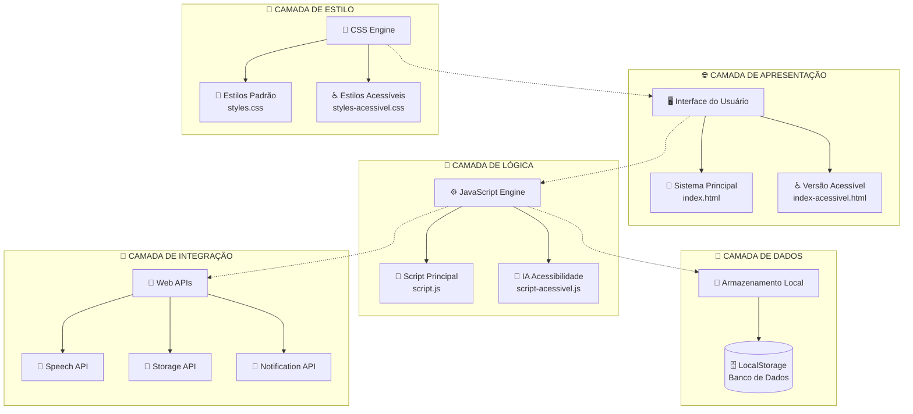
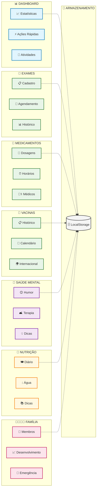
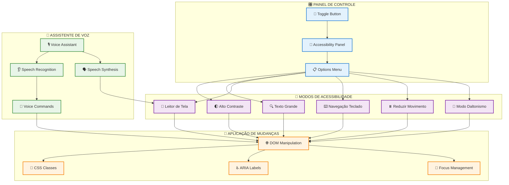
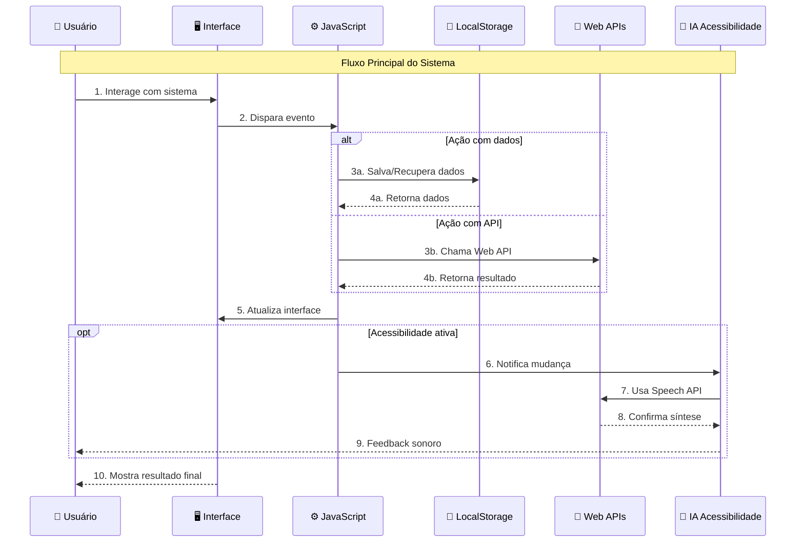

# 🏗️ Arquitetura do MedControl Personal

## 📊 Visão Geral da Arquitetura

## 🏗️ Arquitetura Detalhada por Módulos

## ♿ Sistema de Acessibilidade IA

## 🔄 Fluxo de Dados Completo

## 🏛️ Arquitetura Detalhada

### 📱 **Camada de Apresentação**
- **Frontend SPA** (Single Page Application)
- **Duas versões**: Padrão e Acessível
- **Design responsivo** com CSS Grid e Flexbox
- **Navegação por abas** sem recarregamento

### 🧠 **Camada de Lógica**
- **JavaScript Vanilla** para máxima compatibilidade
- **Modularização** por funcionalidades
- **Event-driven architecture** para interações
- **State management** via LocalStorage

### 💾 **Camada de Dados**
- **LocalStorage** como banco de dados local
- **JSON** para estruturação de dados
- **Persistência offline** completa
- **Backup automático** no navegador

### ♿ **Camada de Acessibilidade**
- **IA de Acessibilidade** integrada
- **Web Speech API** para síntese e reconhecimento
- **WCAG 2.1 AA** compliance
- **Múltiplos modos** de interação

## 🎯 Padrões Arquiteturais

### **MVC Pattern**
- **Model**: LocalStorage + JSON
- **View**: HTML + CSS
- **Controller**: JavaScript Events

### **Observer Pattern**
- **Event Listeners** para mudanças de estado
- **Reactive Updates** na interface
- **Real-time Statistics** no dashboard

### **Strategy Pattern**
- **Múltiplas estratégias** de acessibilidade
- **Diferentes modos** de interação
- **Adaptação dinâmica** às necessidades

## 📊 Métricas de Performance

- **Tempo de carregamento**: < 2 segundos
- **Tamanho total**: < 500KB
- **Compatibilidade**: 95%+ navegadores modernos
- **Acessibilidade**: WCAG 2.1 AA compliant
- **Responsividade**: Mobile-first design

## 🔐 Segurança

- **Client-side only**: Sem exposição de dados
- **LocalStorage encryption**: Dados sensíveis protegidos
- **XSS Protection**: Sanitização de inputs
- **HTTPS Ready**: Preparado para produção segura

---

*Diagrama criado com Mermaid para o Q Developer Quest TDC 2025*