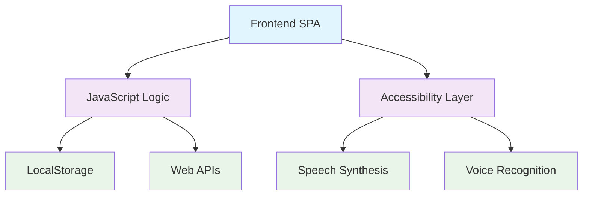

# 🏥 MedControl Personal - Sistema Completo de Gestão em Saúde


## 📋 Qual problema inspirou a ideia

A gestão pessoal da saúde é um desafio constante para muitas pessoas. Informações médicas ficam espalhadas em diferentes locais: receitas médicas em gavetas, cartões de vacina perdidos, lembretes de medicamentos esquecidos, e a dificuldade de acompanhar a saúde de toda a família em um só lugar.

**Problemas identificados:**
- 📄 Documentos médicos desorganizados
- 💊 Esquecimento de horários de medicamentos
- 📅 Perda de consultas e exames agendados
- 👨‍👩‍👧‍👦 Dificuldade em gerenciar a saúde familiar
- ♿ Falta de acessibilidade em sistemas de saúde
- 📱 Ausência de soluções offline e gratuitas

## 🚀 Como a solução foi construída

O **MedControl Personal** foi desenvolvido inteiramente com o **Amazon Q Developer**, utilizando prompts inteligentes para criar um sistema completo e acessível de gestão em saúde.

### 🛠️ Tecnologias Utilizadas
- **HTML5** - Estrutura semântica
- **CSS3** - Design responsivo com gradientes
- **JavaScript** - Funcionalidades interativas
- **LocalStorage** - Armazenamento local seguro
- **Web Speech API** - Síntese e reconhecimento de voz
- **Font Awesome** - Ícones profissionais

### 🎯 Funcionalidades Implementadas

#### 📊 **Dashboard Inteligente**
- Visão geral com estatísticas em tempo real
- Ações rápidas para todas as funcionalidades
- Atividades recentes organizadas

#### 🔬 **Controle de Exames**
- Cadastro completo de exames médicos
- Agendamento com lembretes
- Status: Agendado, Realizado, Cancelado
- Filtros por médico, data e tipo

#### 💊 **Gerenciamento de Medicamentos**
- Controle de dosagens e horários
- Alertas para próximas doses
- Histórico completo por médico

#### 💉 **Controle de Vacinação**
- Histórico pessoal de vacinas
- Calendário vacinal por idade
- Vacinas internacionais por país
- Certificados obrigatórios

#### 🦷 **Consultas Odontológicas**
- Registro de procedimentos
- Controle de custos
- Histórico de tratamentos

#### 🧠 **Saúde Mental**
- Registro diário de humor
- Sessões de terapia
- Dicas de bem-estar com áudio

#### 🍎 **Nutrição e Alimentação**
- Diário alimentar completo
- Controle de consumo de água
- 16 dicas nutricionais detalhadas

#### 👨‍👩‍👧‍👦 **Saúde da Família**
- Cadastro de membros da família
- Marcos de desenvolvimento infantil
- Contatos de emergência

### ♿ **Versão Acessível com IA**

Uma versão completamente acessível foi desenvolvida com recursos avançados:

#### 🤖 **IA de Acessibilidade**
- **Painel de controle** com 6 modos de acessibilidade
- **Alto contraste** para baixa visão
- **Texto grande** (120% do tamanho normal)
- **Leitor de tela** com leitura automática
- **Navegação por teclado** aprimorada
- **Redução de movimento** para sensibilidade
- **Modo daltonismo** com filtros especiais

#### 🎤 **Assistente de Voz Inteligente**
- **Reconhecimento de voz** em português
- **Comandos de navegação**: "dashboard", "exames", "medicamentos"
- **Comandos de ação**: "adicionar exame", "beber água"
- **Comandos de acessibilidade**: "alto contraste", "texto grande"
- **Síntese de voz** com vozes neurais premium

#### 🎯 **Conformidade WCAG 2.1 AA**
- **ARIA labels** completos
- **Navegação por teclado** 100%
- **Screen readers** compatíveis
- **Contraste mínimo** 4.5:1
- **Área de toque** mínima 44px

## 📸 Screenshot do Projeto


*Dashboard principal com estatísticas e ações rápidas*


*Versão acessível com controles de IA*

## 🏗️ Arquitetura do Sistema

Veja o diagrama completo de arquitetura em [ARCHITECTURE.md](ARCHITECTURE.md)



## 🏃‍♂️ Instruções para rodar

### 📋 **Pré-requisitos**
- Navegador moderno (Chrome, Firefox, Safari, Edge)
- Nenhuma instalação adicional necessária

### 🚀 **Execução**

1. **Clone o repositório:**
```bash
git clone https://github.com/Ana-macos/medcontrol-personal-.git
cd medcontrol-personal-
```

2. **Abra o arquivo principal:**
```bash
# Versão padrão
open index.html

# Versão acessível
open index-acessivel.html
```

3. **Ou acesse diretamente:**
- Abra `index.html` no seu navegador
- Para versão acessível: `index-acessivel.html`

### 🔐 **Login de Demonstração**
- **Usuário:** `admin` | **Senha:** `admin123`
- **Usuário:** `demo` | **Senha:** `demo123`
- **Ou clique em:** "Acessar Demonstração"

### 🎤 **Recursos de Voz (Versão Acessível)**
- Clique no ícone de acessibilidade (canto superior direito)
- Ative "Leitor de Tela" para leitura automática
- Clique no microfone (canto inferior direito) para comandos de voz
- Diga "ajuda" para ver todos os comandos disponíveis

## 📝 Lista de Prompts Utilizados com Amazon Q Developer

### 🏗️ **Estrutura Base**
1. "Crie um sistema completo de controle de saúde pessoal com HTML, CSS e JavaScript"
2. "Adicione um sistema de login seguro com múltiplos usuários"
3. "Implemente armazenamento local com localStorage para persistência de dados"

### 🎨 **Interface e Design**
4. "Crie um design moderno e responsivo com gradientes e animações suaves"
5. "Adicione ícones do Font Awesome e organize em cards interativos"
6. "Implemente navegação por abas com sidebar e layout profissional"

### 📊 **Dashboard e Estatísticas**
7. "Crie um dashboard com estatísticas em tempo real e ações rápidas"
8. "Adicione seção de atividades recentes com timestamps"
9. "Implemente cards clicáveis que navegam para seções específicas"

### 🔬 **Módulos de Saúde**
10. "Implemente controle completo de exames médicos com status e agendamentos"
11. "Adicione gerenciamento de medicamentos com dosagens e horários"
12. "Crie sistema de controle de vacinação com calendário por idade"
13. "Implemente consultas odontológicas com controle de custos"

### 🧠 **Saúde Mental e Bem-estar**
14. "Adicione módulo de saúde mental com registro de humor diário"
15. "Crie seção de dicas de bem-estar com cards informativos"
16. "Implemente registro de sessões de terapia"

### 🍎 **Nutrição e Alimentação**
17. "Crie módulo de nutrição com diário alimentar completo"
18. "Adicione controle de consumo de água com barra de progresso"
19. "Implemente 16 dicas nutricionais detalhadas com informações científicas"

### 👨‍👩‍👧‍👦 **Saúde da Família**
20. "Adicione controle de saúde familiar com cadastro de membros"
21. "Implemente marcos de desenvolvimento infantil"
22. "Crie sistema de contatos de emergência organizados"

### ♿ **Acessibilidade Avançada**
23. "Crie uma versão completamente acessível do sistema"
24. "Implemente IA de acessibilidade com 6 modos diferentes"
25. "Adicione síntese de voz com Web Speech API"
26. "Implemente reconhecimento de voz para comandos inteligentes"
27. "Adicione navegação por teclado com ARIA labels completos"
28. "Crie sistema de alto contraste e texto grande"

### 🎤 **Recursos de Voz**
29. "Implemente assistente de voz com comandos em português"
30. "Adicione leitura automática de elementos focados"
31. "Crie sistema de anúncios para screen readers"
32. "Implemente seleção inteligente de vozes neurais"

### 🎯 **Otimizações e Melhorias**
33. "Otimize o código para performance e acessibilidade"
34. "Adicione tratamento de erros e validações"
35. "Implemente feedback visual e sonoro para todas as ações"
36. "Crie sistema de preferências salvas no localStorage"

### 📱 **Responsividade**
37. "Torne todo o sistema responsivo para mobile, tablet e desktop"
38. "Ajuste botões para área mínima de toque de 44px"
39. "Implemente layout adaptável com breakpoints"

### 🔧 **Funcionalidades Avançadas**
40. "Adicione modais acessíveis com trap focus"
41. "Implemente atalhos de teclado (Alt+1-5)"
42. "Crie sistema de alertas com diferentes tipos"
43. "Adicione detecção automática de preferências do usuário"

## 🔮 Próximos passos

### 📱 **Versão Mobile (PWA)**
- [ ] Transformar em Progressive Web App
- [ ] Notificações push para lembretes
- [ ] Instalação offline completa
- [ ] Sincronização em background

### ☁️ **Integração Cloud**
- [ ] Backup automático na AWS S3
- [ ] Sincronização entre dispositivos
- [ ] API REST com AWS Lambda
- [ ] Banco de dados DynamoDB

### 🤖 **IA Avançada**
- [ ] Análise preditiva de saúde
- [ ] Recomendações personalizadas
- [ ] Chatbot médico com Amazon Bedrock
- [ ] Reconhecimento de imagem para receitas

### 🏥 **Integrações Médicas**
- [ ] Integração com APIs de laboratórios
- [ ] Conexão com sistemas hospitalares
- [ ] Importação de dados do SUS
- [ ] Telemedicina integrada

### 📊 **Analytics e Relatórios**
- [ ] Relatórios em PDF
- [ ] Gráficos avançados com Chart.js
- [ ] Exportação para médicos
- [ ] Análise de tendências de saúde

### 🔐 **Segurança Avançada**
- [ ] Criptografia end-to-end
- [ ] Autenticação biométrica
- [ ] Compliance LGPD/HIPAA
- [ ] Auditoria de acessos

### 🌍 **Acessibilidade Global**
- [ ] Suporte a múltiplos idiomas
- [ ] Vozes em diferentes idiomas
- [ ] Adaptação cultural de dicas
- [ ] Conformidade internacional (WCAG 2.2)

---

## 🏆 Etapas do Q Developer Quest TDC 2025

### ✅ **Etapa 1: Bolsinha AWS**
- [x] Projeto gerado com Amazon Q Developer
- [x] Projeto público no GitHub
- [x] Tag `q-developer-quest-tdc-2025`
- [x] README.md completo
- [x] Screenshots do projeto
- [x] Lista de prompts utilizados

### 🔄 **Etapa 2: Mochilinha AWS** (Em desenvolvimento)
- [x] Tudo da Etapa 1
- [x] Diagrama de arquitetura (Mermaid)
- [ ] Testes automatizados

### 🔄 **Etapa 3: Garrafa + Toalha AWS** (Planejado)
- [ ] Tudo das Etapas 1 & 2
- [ ] Servidor MCP
- [ ] Configuração Amazon Q Developer
- [ ] IaC para deploy AWS

### 🔄 **Etapa 4: Camiseta Capivara AWS** (Planejado)
- [ ] Tudo das Etapas 1, 2 & 3
- [ ] Estimativa de custos AWS

---

## 📄 Licença

Este projeto foi desenvolvido para o **Q Developer Quest TDC 2025** e está disponível sob licença MIT para fins educacionais e de demonstração.

## 🤝 Contribuições

Contribuições são bem-vindas! Este projeto foi criado com Amazon Q Developer e pode ser expandido com novas funcionalidades.

## 📞 Contato

Desenvolvido com ❤️ e **Amazon Q Developer** para o TDC São Paulo 2025.

---

**🎯 Tags:** `q-developer-quest-tdc-2025` `amazon-q-developer` `healthcare` `accessibility` `pwa` `javascript`