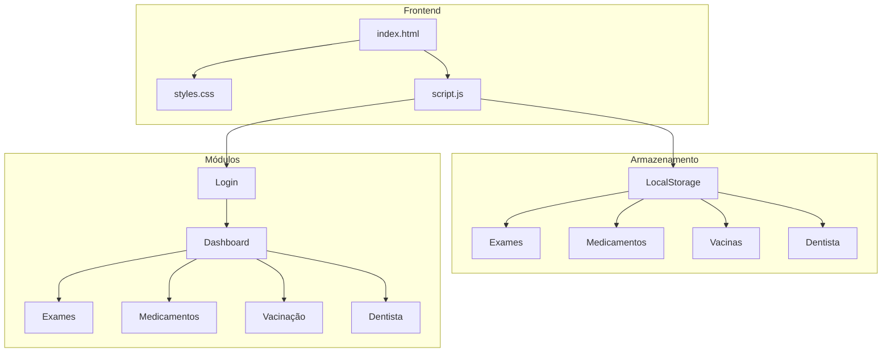

# Arquitetura do MedControl Personal

## Diagrama de Arquitetura

## Componentes

### Frontend
- **HTML5**: Interface responsiva
- **CSS3**: Design moderno
- **JavaScript**: Lógica de negócio

### Dados
- **LocalStorage**: Persistência local
- **195+ países**: Base de vacinas
- **Certificados**: CIVP, Meningocócica, etc.

### Funcionalidades
- Sistema de login
- Dashboard interativo
- Controle médico completo
- Busca internacional de vacinas