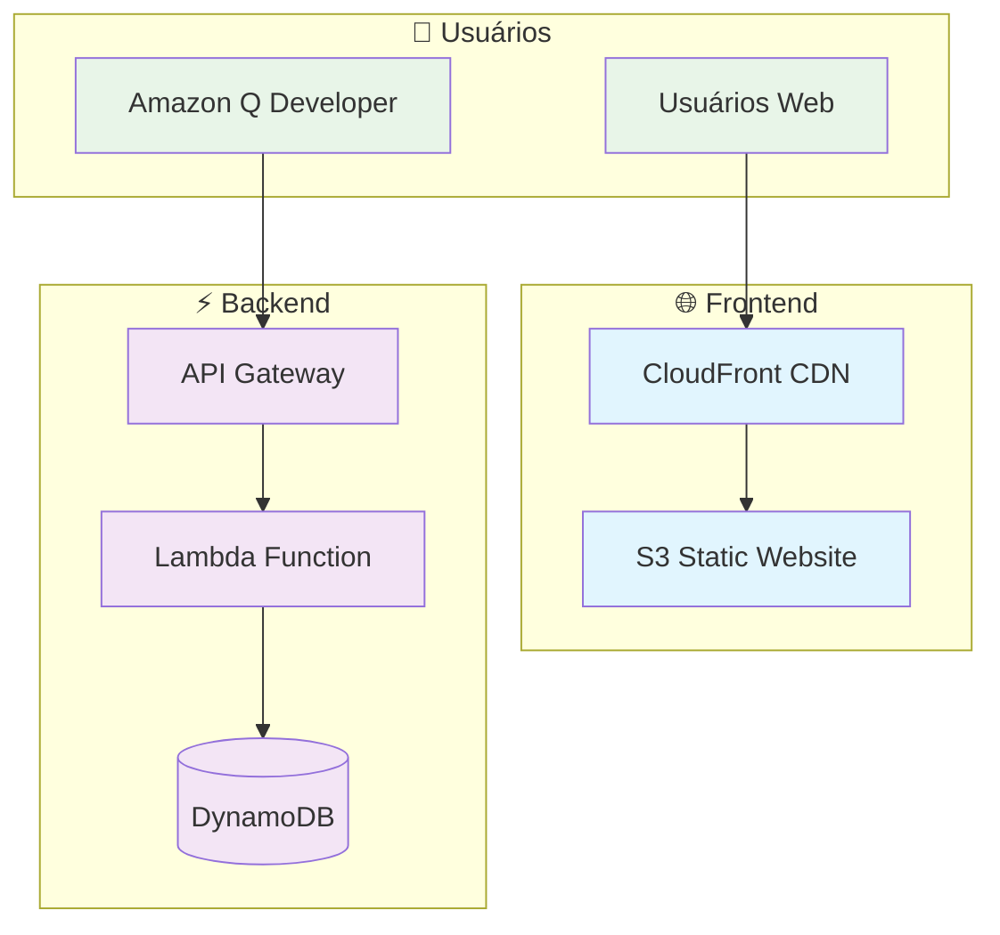

# 🏗️ Infraestrutura AWS - MedControl Personal

Infraestrutura como Código (IaC) usando Terraform para deploy do MedControl Personal na AWS.

## 🏛️ Arquitetura AWS



## 📦 Recursos AWS Criados

### 🌐 **Frontend**
- **S3 Bucket** - Hospedagem estática do website
- **CloudFront** - CDN global para performance

### ⚡ **Backend**
- **Lambda Function** - Servidor MCP serverless
- **API Gateway** - Endpoint REST para MCP
- **DynamoDB** - Banco de dados NoSQL

### 🔐 **Segurança**
- **IAM Roles** - Permissões mínimas necessárias
- **S3 Bucket Policy** - Acesso público controlado

## 💰 Estimativa de Custos

| Serviço | Uso Estimado | Custo Mensal |
|---------|--------------|--------------|
| S3 Storage | 1GB | ~$0.50 |
| CloudFront | 10GB transfer | ~$1.00 |
| Lambda | 1M requests | ~$0.20 |
| DynamoDB | 25 RCU/WCU | ~$1.25 |
| API Gateway | 1M requests | ~$3.50 |
| **Total** | | **~$6.45/mês** |

## 🚀 Como Usar

### 📋 **Pré-requisitos**
- AWS CLI configurado
- Terraform >= 1.0 instalado
- Credenciais AWS com permissões adequadas

### ⚙️ **Configuração**
```bash
# 1. Copiar arquivo de variáveis
cp terraform.tfvars.example terraform.tfvars

# 2. Editar configurações
nano terraform.tfvars

# 3. Inicializar Terraform
terraform init

# 4. Planejar deploy
terraform plan

# 5. Aplicar infraestrutura
terraform apply
```

### 📁 **Deploy dos Arquivos**
```bash
# Sincronizar arquivos para S3
aws s3 sync . s3://BUCKET_NAME --exclude '*.tf' --exclude 'terraform/*'

# Invalidar cache do CloudFront
aws cloudfront create-invalidation --distribution-id DISTRIBUTION_ID --paths '/*'

# Atualizar função Lambda
zip -r mcp-server.zip mcp-server/
aws lambda update-function-code --function-name FUNCTION_NAME --zip-file fileb://mcp-server.zip
```

## 🔧 Configurações Avançadas

### 🌍 **Domínio Personalizado**
```hcl
# terraform.tfvars
domain_name = "medcontrol.exemplo.com"
```

### 📊 **Monitoramento**
```hcl
# terraform.tfvars
enable_logging = true
```

### ⚡ **Performance**
```hcl
# terraform.tfvars
lambda_memory_size = 512
cloudfront_price_class = "PriceClass_200"
```

## 🗂️ Estrutura de Arquivos

```
terraform/
├── main.tf              # Recursos principais
├── variables.tf         # Definição de variáveis
├── outputs.tf          # Outputs do Terraform
├── terraform.tfvars.example  # Exemplo de configuração
└── README.md           # Esta documentação
```

## 🔄 Comandos Úteis

```bash
# Verificar estado atual
terraform show

# Destruir infraestrutura
terraform destroy

# Formatar código
terraform fmt

# Validar configuração
terraform validate

# Ver outputs
terraform output
```

## 🛡️ Segurança

- **Princípio do menor privilégio** aplicado
- **HTTPS obrigatório** via CloudFront
- **Dados criptografados** em trânsito e repouso
- **Acesso controlado** via IAM

## 📈 Monitoramento

- **CloudWatch Logs** para Lambda
- **CloudWatch Metrics** para todos os serviços
- **X-Ray Tracing** para debugging

## 🔧 Troubleshooting

### Erro de Permissões
```bash
aws sts get-caller-identity
aws iam list-attached-user-policies --user-name SEU_USUARIO
```

### Lambda Cold Start
```hcl
# Aumentar memória para reduzir cold start
lambda_memory_size = 512
```

### CloudFront Cache
```bash
# Invalidar cache manualmente
aws cloudfront create-invalidation --distribution-id ID --paths '/*'
```

---

*Infraestrutura criada para o Q Developer Quest TDC 2025*